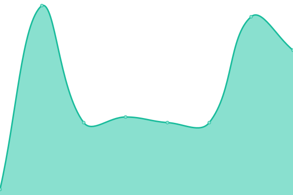

# [📈 Live Status](https://status.dictybase.dev): <!--live status--> **🟧 Partial outage**

This repository contains the open-source uptime monitor and status page for [dictyBase Docker](http://dictybase.org), powered by [Upptime](https://github.com/upptime/upptime).

With [Upptime](https://upptime.js.org), you can get your own unlimited and free uptime monitor and status page, powered entirely by a GitHub repository. We use [Issues](https://github.com/dictybase-docker/uptime/issues) as incident reports, [Actions](https://github.com/dictybase-docker/uptime/actions) as uptime monitors, and [Pages](https://status.dictybase.dev) for the status page.

<!--start: status pages-->
<!-- This summary is generated by Upptime (https://github.com/upptime/upptime) -->
<!-- Do not edit this manually, your changes will be overwritten -->
<!-- prettier-ignore -->
| URL | Status | History | Response Time | Uptime |
| --- | ------ | ------- | ------------- | ------ |
|  [DCR](https://dictycr.org) | 🟩 Up | [dcr.yml](https://github.com/dictybase-docker/uptime/commits/HEAD/history/dcr.yml) | 

 302ms
     
 | 

<a href="https://status.dictybase.dev/history/dcr">100.00%</a>
    

|  [DCR dev](https://dictybase.dev) | 🟩 Up | [dcr-dev.yml](https://github.com/dictybase-docker/uptime/commits/HEAD/history/dcr-dev.yml) | 

 14ms
     
 | 

<a href="https://status.dictybase.dev/history/dcr-dev">100.00%</a>
    

|  [DSR dev](https://dictbase.dev/stockcenter) | 🟥 Down | [dsr-dev.yml](https://github.com/dictybase-docker/uptime/commits/HEAD/history/dsr-dev.yml) | 

 0ms
     
 | 

<a href="https://status.dictybase.dev/history/dsr-dev">3.96%</a>
    

<!--end: status pages-->

[**Visit our status website →**](https://status.dictybase.dev)

## 📄 License

- Powered by: [Upptime](https://github.com/upptime/upptime)
- Code: [MIT](./LICENSE) © [Anand Chowdhary](https://anandchowdhary.com), supported by [Pabio](https://pabio.com)
- Data in the `./history` directory: [Open Database License](https://opendatacommons.org/licenses/odbl/1-0/)
